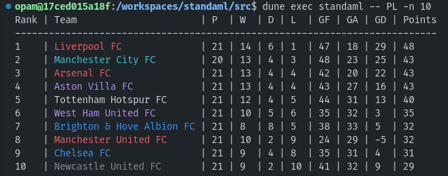

:england: [English version/Versão inglesa](README-en.md)
***

# Standaml [](https://github.com/TheLusitanianKing/Standaml/actions/workflows/docker-image.yml)
Classificação das tuas ligas preferidas de futebol no teu terminal

Fonte dos resultados: https://www.football-data.org

## Uso

```bash
# primeiras 5 equipas da Primeira Liga portuguesa (código: PPL)
dune exec standaml -- PPL -n 5

# pode ver as diferentes opções
dune exec standaml -- --help 
```

### Exemplo com a Premier League inglesa (Janeiro 2024)


## Configuração

### Token do football-data
Em primeiro lugar, precisa registar-se no site do https://www.football-data.org e recuperar um token. Uma vez inscrito deverá recebê-lo por email ou pelo site.
Uma vez recuperado, basta inseri-lo no ficheiro de configuração (`standaml.conf`) copiando o template (`standaml.default.conf`).

Exemplo:
```bash
cp standaml.default.conf standaml.conf # copiar o template
vim standaml.conf # abrir o ficheiro de configuração com vim (ou outro) e inserir o token no lugar adequado
```

### (Opcional) Cores
Se quiser ter cores associadas à alguns clubes:

```bash
cp colour.default.conf colour.conf # copiar o template
vim colour.conf # abrir o ficheiro de configuração
```
Pode no ficheiro associar os clubes desta forma: `Clube A=Cor`, cada linha sendo uma instrução.
As cores disponíveis de momento são: Preto (`Black`), Vermelho (`Red`), Verde (`Green`), Amarelo (`Yellow`), Azul (`Blue`), `Magenta`, Ciano (`Cyan`) e Branco (`White`)


### Pré-requisitos
#### Opção instalação manual
Pode optar por instalar tudo localmente, usando o Dockerfile como guia no que diz respeito às versões utilizadas de OCaml e das dependências. Em `src/`, encontrará um `Makefile` que pode usar com `make`, ou usar apenas como referência para ver os comandos `dune` e usar essas diretamente.

#### Opção Docker
A minha sugestão é simplesmente usar o Dockerfile. Por exemplo:
```bash
# criar a imagem Docker
docker build -t standaml/ocaml .

# e, estando na pasta do projeto (caso contrário, pode inserir o valor do `src` manualmente), pode executar um comando assim
docker run --rm -w /app --mount type=bind,src=$(pwd),dst=/app standaml/ocaml sh -c "cd src && dune exec standaml -- PPL -n 5"
```
É um pouco "verbose" mas é a opção que menos esforço necessita.

#### Opção VSCode dev containers
Caso pretende contribuir ou apenas explorar o código, pode usar os dev containers do VSCode, usando a pasta `.devcontainer/`. Mais informação em https://code.visualstudio.com/docs/devcontainers/containers.

### Competições disponíveis
Pode encontrar uma lista de todas as competições no seguinte link: https://docs.football-data.org/general/v4/lookup_tables.html#_league_codes. Verifica que a competição que deseja se encontra no seu plano.
O plano gratuito (tier one) dá acesso as competições principais, incluindo as seguintes:

* :portugal: PPL - Primeira Liga
* :england: PL - Premier League
* :fr: FL1 - Ligue 1
* :de: BL1 - Bundesliga
* :es: PD - La Liga (Primera División)
* :it: SA - Serie A 
* :netherlands: DED - Eredivisie
* :brazil: BSA - Brasileirão

Relembrando aqui que só funciona com competições em formato de liga.

## Futuras melhorias e bugs
Ver [Issues](https://github.com/TheLusitanianKing/Standaml/issues)

## Licença
ver [Licença MIT](LICENSE).
